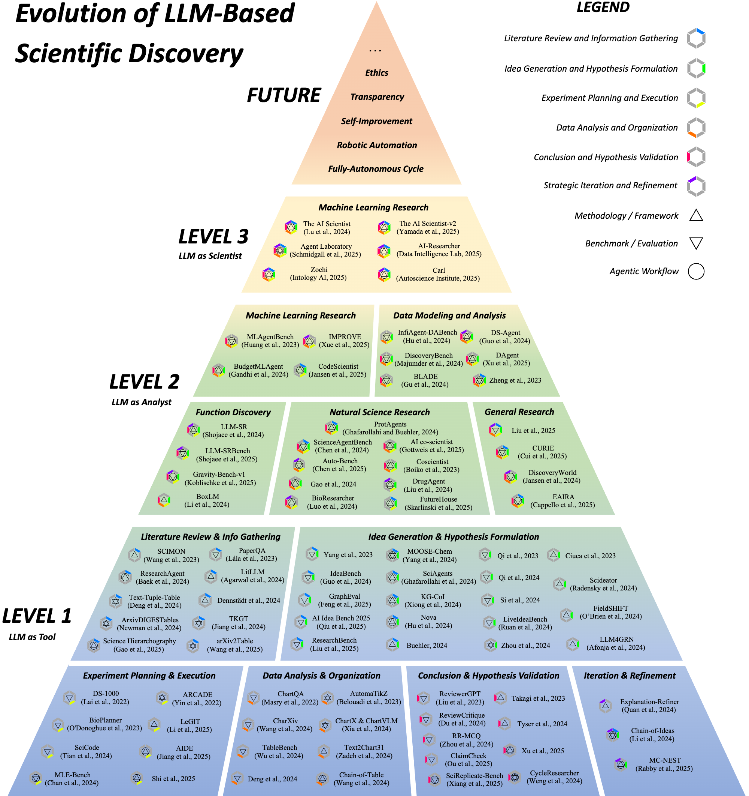

# Awesome LLM Scientific Discovery [](https://awesome.re)

A curated list of pioneering research papers, tools, and resources at the intersection of Large Language Models (LLMs) and Scientific Discovery. 

Survey: ***From Automation to Autonomy: A Survey on Large Language Models in Scientific Discovery.*** ([https://arxiv.org/abs/2505.13259])

The survey delineates the evolving role of LLMs in science through a three-level autonomy framework:
*   **Level 1: LLM as Tool:** LLMs augmenting human researchers for specific, well-defined tasks.
*   **Level 2: LLM as Analyst:** LLMs exhibiting greater autonomy in processing complex information and offering insights.
*   **Level 3: LLM as Scientist:** LLM-based systems autonomously conducting major research stages.

Below is a visual representation of this taxonomy:



We aim to provide a comprehensive overview for researchers, developers, and enthusiasts interested in this rapidly advancing field.

> **Last major update: 2026.07.** This refresh adds a large batch of 2025–2026 papers and a dedicated section on frontier industry-lab systems (Google DeepMind, OpenAI, Microsoft Research, Meta FAIR, FutureHouse, Sakana AI, and others). Contributions and PRs are very welcome — see [Contributing](#contributing).

## Contents

*   [Level 1: LLM as Tool](#level-1-llm-as-tool)
    *   [Literature Review and Information Gathering](#literature-review-and-information-gathering)
    *   [Idea Generation and Hypothesis Formulation](#idea-generation-and-hypothesis-formulation)
    *   [Experiment Planning and Execution](#experiment-planning-and-execution)
    *   [Data Analysis and Organization](#data-analysis-and-organization)
    *   [Conclusion and Hypothesis Validation](#conclusion-and-hypothesis-validation)
    *   [Iteration and Refinement](#iteration-and-refinement)
*   [Level 2: LLM as Analyst](#level-2-llm-as-analyst)
    *   [Machine Learning Research](#machine-learning-research)
    *   [Data Modeling and Analysis](#data-modeling-and-analysis)
    *   [Function Discovery](#function-discovery)
    *   [Natural Science Research](#natural-science-research)
    *   [General Research](#general-research)
    *   [Survey Generation](#survey-generation)
*   [Level 3: LLM as Scientist](#level-3-llm-as-scientist)
    *   [General-Purpose Autonomous Research Agents](#general-purpose-autonomous-research-agents)
    *   [Discovery-Oriented Scientific Systems](#discovery-oriented-scientific-systems)
    *   [Autonomous Research Ecosystems and Infrastructure](#autonomous-research-ecosystems-and-infrastructure)
*   [Frontier Labs and Foundation Models for Science](#frontier-labs-and-foundation-models-for-science)
*   [Other Related Works](#other-related-works)
*   [Contributing](#contributing)

---

## Level 1: LLM as Tool

At this foundational level, LLMs function as tailored tools under direct human supervision, designed to execute specific, well-defined tasks within a single stage of the scientific method. Their primary goal is to enhance researcher efficiency.

### Literature Review and Information Gathering

Automating literature search, retrieval, synthesis, structuring, and organization.

*   **SCIMON : Scientific Inspiration Machines Optimized for Novelty** [](https://arxiv.org/pdf/2305.14259) - *Wang et al. (2023.05)*
*   **ResearchAgent: Iterative research idea generation over scientific literature with Large Language Models** [](https://arxiv.org/pdf/2404.07738) - *Baek et al. (2024.04)*
*   **Text-Tuple-Table: Towards Information Integration in Text-to-Table Generation via Global Tuple Extraction** [](https://arxiv.org/pdf/2404.14215) - *Deng et al. (2024.04)*
*   **TKGT: Redefinition and A New Way of text-to-table tasks based on real world demands and knowledge graphs augmented LLMs** [](https://aclanthology.org/2024.emnlp-main.901.pdf) - *Jiang et al. (2024.10)*
*   **ArxivDIGESTables: Synthesizing scientific literature into tables using language models** [](https://arxiv.org/pdf/2410.22360) - *Newman et al. (2024.10)*
*   **Can LLMs Generate Tabular Summaries of Science Papers? Rethinking the Evaluation Protocol** [](https://arxiv.org/pdf/2504.10284) - *Wang et al. (2025.04)*
*   **LitLLM: A Toolkit for Scientific Literature Review** [](https://arxiv.org/pdf/2402.01788v1) - *Agarwal et al. (2024.02)*
*   **Title and abstract screening for literature reviews using large language models: an exploratory study in the biomedical domain** [](https://systematicreviewsjournal.biomedcentral.com/articles/10.1186/s13643-024-02575-4) - *Dennstädt et al. (2024.06)*
*   **Science Hierarchography: Hierarchical Organization of Science Literature** [](https://arxiv.org/pdf/2504.13834) - *Gao et al. (2025.04)* 
*   **Language Agents Achieve Superhuman Synthesis of Scientific Knowledge (PaperQA2)** [](https://arxiv.org/pdf/2409.13740) - *Skarlinski et al. (2024.09)*
*   **DeepResearch Bench: A Comprehensive Benchmark for Deep Research Agents** [](https://arxiv.org/pdf/2506.11763) - *Du et al. (2025.06)*
*   **Deep Research Agents: A Systematic Examination And Roadmap** [](https://arxiv.org/pdf/2506.18096) - *Huang et al. (2025.06)*
*   **DeepScholar-Bench: A Live Benchmark and Automated Evaluation for Generative Research Synthesis** [](https://arxiv.org/pdf/2508.20033) - *Patel et al. (2025.08)*
*   **ResearcherBench: Evaluating Deep AI Research Systems on the Frontiers of Scientific Inquiry** [](https://arxiv.org/pdf/2507.16280) - *Xu et al. (2025.07)*
*   **LiRA: A Multi-Agent Framework for Reliable and Readable Literature Review Generation** [](https://arxiv.org/pdf/2510.05138) - *Zhang et al. (2025.10)*

### Idea Generation and Hypothesis Formulation

Automated generation of novel research ideas, conceptual insights, and testable scientific hypotheses.

*   **SciAgents: Automating scientific discovery through multi-agent intelligent graph reasoning** [](https://arxiv.org/pdf/2409.05556) - *Ghafarollahi et al. (2024.09)*
*   **Accelerating scientific discovery with generative knowledge extraction, graph-based representation, and multimodal intelligent graph reasoning** [](https://arxiv.org/pdf/2403.11996) - *Buehler (2024.03)*
*   **MOOSE-Chem: Large Language Models for Rediscovering Unseen Chemistry Scientific Hypotheses** [](https://arxiv.org/pdf/2410.07076) - *Yang et al. (2024.10)*
*   **Large Language Models for Automated Open-domain Scientific Hypotheses Discovery** [](https://arxiv.org/pdf/2309.02726) - *Yang et al. (2023.09)*
*   **Improving Scientific Hypothesis Generation with Knowledge Grounded Large Language Models** [](https://arxiv.org/pdf/2411.02382) - *Xiong et al. (2024.11)*
*   **ResearchBench: Benchmarking LLMs in Scientific Discovery via Inspiration-Based Task Decomposition** [](https://arxiv.org/pdf/2503.21248) - *Liu et al. (2025.03)*
*   **AI Idea Bench 2025: AI Research Idea Generation Benchmark** [](https://arxiv.org/pdf/2504.14191) - *Qiu et al. (2025.04)*
*   **IdeaBench: Benchmarking Large Language Models for Research Idea Generation** [](https://arxiv.org/pdf/2411.02429) - *Guo et al. (2024.11)*
*   **Can LLMs Generate Novel Research Ideas? A Large-Scale Human Study with 100+ NLP Researchers** [](https://arxiv.org/pdf/2409.04109) - *Si et al. (2024.09)*
*   **Learning to Generate Research Idea with Dynamic Control** [](https://arxiv.org/pdf/2412.14626) - *Li et al. (2024.12)*
*   **LiveIdeaBench: Evaluating LLMs' Divergent Thinking for Scientific Idea Generation with Minimal Context** [](https://arxiv.org/pdf/2412.17596) - *Ruan et al. (2024.12)*
*   **Nova: An Iterative Planning and Search Approach to Enhance Novelty and Diversity of LLM Generated Ideas** [](https://arxiv.org/pdf/2410.14255) - *Hu et al. (2024.10)*
*   **GraphEval: A Lightweight Graph-Based LLM Framework for Idea Evaluation** [](https://arxiv.org/pdf/2503.12600) - *Feng et al. (2025.03)*
*   **Hypothesis Generation with Large Language Models** [](https://arxiv.org/pdf/2404.04326) - *Zhou et al. (2024.04)*
*   **Harnessing the Power of Adversarial Prompting and Large Language Models for Robust Hypothesis Generation in Astronomy** [](https://arxiv.org/pdf/2306.11648) - *Ciuca et al. (2023.06)*
*   **Large Language Models are Zero Shot Hypothesis Proposers** [](https://arxiv.org/pdf/2311.05965) - *Qi et al. (2023.11)*
*   **Machine learning for hypothesis generation in biology and medicine: exploring the latent space of neuroscience and developmental bioelectricity** [](https://pubs.rsc.org/en/content/articlelanding/2024/dd/d3dd00185g) - *O’Brien et al. (2023.07)*
*   **Large Language Models as Biomedical Hypothesis Generators: A Comprehensive Evaluation** [](https://arxiv.org/pdf/2407.08940) - *Qi et al. (2024.07)*
*   **LLM4GRN: Discovering Causal Gene Regulatory Networks with LLMs -- Evaluation through Synthetic Data Generation** [](https://arxiv.org/pdf/2410.15828) - *Afonja et al. (2024.10)*
*   **Scideator: Human-LLM Scientific Idea Generation Grounded in Research-Paper Facet Recombination** [](https://arxiv.org/pdf/2409.14634) - *Radensky et al. (2024.09)*
*   **HypER: Literature-grounded Hypothesis Generation and Distillation with Provenance** [](https://arxiv.org/pdf/2506.12937) - *Vasu et al. (2025.06)*
*   **Sparks of Science: Hypothesis Generation Using Structured Paper Data** [](https://arxiv.org/pdf/2504.12976) - *O'Neill et al. (2025.04)*
*   **A Survey on Hypothesis Generation for Scientific Discovery in the Era of Large Language Models** [](https://arxiv.org/pdf/2504.05496) - *Kulkarni et al. (2025.04)*
*   **Deep Ideation: Designing LLM Agents to Generate Novel Research Ideas on Scientific Concept Networks** [](https://arxiv.org/pdf/2511.02238) - *Wang et al. (2025.11)*

### Experiment Planning and Execution

LLMs assisting in experimental protocol planning, workflow design, and scientific code generation.

*   **BioPlanner: Automatic Evaluation of LLMs on Protocol Planning in Biology** [](https://arxiv.org/pdf/2310.10632) - *O'Donoghue et al. (2023.10)*
*   **Can Large Language Models Help Experimental Design for Causal Discovery?** (Li et al. in survey) [](https://arxiv.org/pdf/2503.01139) - *Li et al. (2025.03)*
*   **Hierarchically Encapsulated Representation for Protocol Design in Self-Driving Labs**  [](https://arxiv.org/pdf/2504.03810) - *Shi et al. (2025.04)*
*   **SciCode: A Research Coding Benchmark Curated by Scientists** [](https://arxiv.org/pdf/2407.13168) - *Tian et al. (2024.07)*
*   **Natural Language to Code Generation in Interactive Data Science Notebooks** [](https://arxiv.org/pdf/2212.09248) - *Yin et al. (2022.12)*
*   **DS-1000: A Natural and Reliable Benchmark for Data Science Code Generation** [](https://arxiv.org/pdf/2211.11501) - *Lai et al. (2022.11)*
*   **Curie: Toward Rigorous and Automated Scientific Experimentation with AI Agents**, [](https://arxiv.org/pdf/2502.16069) - *Kon et al. (2025.02)*
*   **AutoNumerics: An Autonomous, PDE-Agnostic Multi-Agent Pipeline for Scientific Computing** [](https://arxiv.org/pdf/2602.17607) - *Du et al. (2026.02)*

### Data Analysis and Organization

LLMs assisting in data-driven analysis, tabular/chart reasoning, statistical reasoning, and model discovery.

*   **AutomaTikZ: Text-Guided Synthesis of Scientific Vector Graphics with TikZ** [](https://arxiv.org/pdf/2310.00367) - *Belouadi et al. (2023.10)*
*   **Text2Chart31: Instruction Tuning for Chart Generation with Automatic Feedback** [](https://arxiv.org/pdf/2410.04064) - *Zadeh et al. (2024.10)*
*   **ChartQA: A Benchmark for Question Answering about Charts with Visual and Logical Reasoning** [](https://arxiv.org/pdf/2203.10244) - *Masry et al. (2022.03)*
*   **CharXiv: Charting Gaps in Realistic Chart Understanding in Multimodal LLMs** [](https://arxiv.org/pdf/2406.18521) - *Wang et al. (2024.06)*
*   **ChartX & ChartVLM: A Versatile Benchmark and Foundation Model for Complicated Chart Reasoning** [](https://arxiv.org/pdf/2402.12185) - *Xia et al. (2024.02)*
*   **Chain-of-Table: Evolving Tables in the Reasoning Chain for Table Understanding** [](https://arxiv.org/pdf/2401.04398) - *Wang et al. (2024.01)*
*   **TableBench: A Comprehensive and Complex Benchmark for Table Question Answering** [](https://arxiv.org/pdf/2408.09174) - *Wu et al. (2024.08)*
*   **Tables as Texts or Images: Evaluating the Table Reasoning Ability of LLMs and MLLMs** [](https://arxiv.org/pdf/2402.12424) - *Deng et al. (2024.02)*
*   **ChatSpatial: Schema-Enforced Agentic Orchestration for Reproducible and Cross-Platform Spatial Transcriptomics** [](https://doi.org/10.64898/2026.02.26.708361) - *Yang et al. (2026.02)* [Code](https://github.com/cafferychen777/ChatSpatial)

### Conclusion and Hypothesis Validation

LLMs providing feedback, verifying claims, replicating results, and generating reviews.

*   **CLAIMCHECK: How Grounded are LLM Critiques of Scientific Papers?** [](https://arxiv.org/pdf/2503.21717) - *Ou et al. (2025.03)*
*   **LLMs Assist NLP Researchers: Critique Paper (Meta-)Reviewing**  [](https://arxiv.org/pdf/2406.16253) - *Du et al. (2024.06)*
*   **AI-Driven Review Systems: Evaluating LLMs in Scalable and Bias-Aware Academic Reviews**  [](https://arxiv.org/pdf/2408.10365) - *Tyser et al. (2024.08)*
*   **Is LLM a Reliable Reviewer? A Comprehensive Evaluation of LLM on Automatic Paper Reviewing Tasks**  [](https://aclanthology.org/2024.lrec-main.816.pdf) - *Zhou et al. (2024.05)*
*   **ReviewerGPT? An Exploratory Study on Using Large Language Models for Paper Reviewing** [](https://arxiv.org/pdf/2306.00622) - *Liu and Shah (2023.06)*
*   **Towards Autonomous Hypothesis Verification via Language Models with Minimal Guidance** [](https://arxiv.org/pdf/2311.09706) - *Takagi et al. (2023.11)*
*   **CycleResearcher: Improving Automated Research via Automated Review** [](https://arxiv.org/pdf/2411.00816) - *Weng et al. (2024.11)*
*   **PaperBench: Evaluating AI’s Ability to Replicate AI Research** [](https://arxiv.org/pdf/2504.01848) - *Starace et al. (2025.04)*
*   **SciReplicate-Bench: Benchmarking LLMs in Agent-driven Algorithmic Reproduction from Research Papers** [](https://arxiv.org/pdf/2504.00255) - *Xiang et al. (2025.04)*
*   **Advancing AI-Scientist Understanding: Making LLM Think Like a Physicist with Interpretable Reasoning** [](https://arxiv.org/pdf/2504.01911) - *Xu et al. (2025.04)*
*   **Generative Adversarial Reviews: When LLMs Become the Critic** [](https://arxiv.org/pdf/2412.10415) - *Bougie & Watanabe (2024.12)*
*   **Predicting Empirical AI Research Outcomes with Language Models** [](https://arxiv.org/pdf/2506.00794) - *Wen et al. (2025.06)*
*   **SPOT: When AI Co-Scientists Fail — A Benchmark for Automated Verification of Scientific Research** [](https://arxiv.org/pdf/2505.11855) - *Son et al. (2025.05)*
*   **DeepReview: Improving LLM-based Paper Review with Human-like Deep Thinking Process** [](https://arxiv.org/pdf/2503.08569) - *Zhu et al. (2025.03)*
*   **ReviewRL: Towards Automated Scientific Review with RL** [](https://arxiv.org/pdf/2508.10308) - *Zeng et al. (2025.08)*
*   **SciClaimHunt: A Large Dataset for Evidence-based Scientific Claim Verification** [](https://arxiv.org/pdf/2502.10003) - *Kumar et al. (2025.02)*
*   **LMR-Bench: Evaluating LLM Agent's Ability on Reproducing Language Modeling Research** [](https://arxiv.org/pdf/2506.17335) - *Yan et al. (2025.06)*
*   **REFUTE: Reasoning Over Evidence - Falsification, Uncertainty, Truth-grounding & Epistemics** [](https://huggingface.co/datasets/BGPT-OFFICIAL/refute) - *BGPT (2026.06)*. Open benchmark for scientific critique and epistemic calibration on recent science paper summaries, covering falsification, limitations, overclaims, missing-evidence refusal, calibration, and planted-flaw detection.

### Iteration and Refinement

LLMs involved in iterative refinement of research hypotheses and strategic exploration.

*   **Verification and Refinement of Natural Language Explanations through LLM-Symbolic Theorem Proving** [](https://arxiv.org/pdf/2405.01379) - *Quan et al. (2024.05)*
*   **Chain of Ideas: Revolutionizing Research Via Novel Idea Development with LLM Agents** [](https://arxiv.org/pdf/2410.13185) - *Li et al. (2024.10)*
*   **Iterative Hypothesis Generation for Scientific Discovery with Monte Carlo Nash Equilibrium Self-Refining Trees** [](https://arxiv.org/pdf/2503.19309) - *Rabby et al. (2025.03)*
*   **XtraGPT: LLMs for Human-AI Collaboration on Controllable Academic Paper Revision** [](https://arxiv.org/pdf/2505.11336) - *Chen et al. (2025.05)*

---

## Level 2: LLM as Analyst

LLMs exhibiting a greater degree of autonomy, functioning as passive agents capable of complex information processing, data modeling, and analytical reasoning with reduced human intervention.

### Machine Learning Research

Automated modeling of machine learning tasks, experiment design, and execution.

*   **MLAgentBench: Evaluating Language Agents on Machine Learning Experimentation** [](https://arxiv.org/pdf/2310.03302) - *Huang et al. (2023.10)*
*   **MLR-Copilot: Autonomous Machine Learning Research based on Large Language Models Agents** [](https://arxiv.org/pdf/2408.14033) - *Li et al. (2024.08)*
*   **MLE-bench: Evaluating Machine Learning Agents on Machine Learning Engineering** [](https://arxiv.org/pdf/2410.07095) - *Chan et al. (2024.10)*
*   **IMPROVE: Iterative Model Pipeline Refinement and Optimization Leveraging LLM Agents** [](https://arxiv.org/pdf/2502.18530v1) - *Xue et al. (2025.02)*
*   **CodeScientist: End-to-End Semi-Automated Scientific Discovery with Code-based Experimentation** [](https://arxiv.org/pdf/2503.22708) - *Jansen et al. (2025.03)*
*   **MLRC-Bench: Can Language Agents Solve Machine Learning Research Challenges?** [](https://arxiv.org/pdf/2504.09702) - *Zhang et al. (2025.04)*
*   **RE-Bench: Evaluating frontier AI R&D capabilities of language model agents against human experts** [](https://arxiv.org/pdf/2411.15114) - *Wijk et al. (2024.11)*
*   **MLZero: A Multi-Agent System for End-to-end Machine Learning Automation** [](https://arxiv.org/pdf/2505.13941) - *Fang et al. (2025.05)*
*   **AIDE: AI-Driven Exploration in the Space of Code** [](https://arxiv.org/pdf/2502.13138) - *Jiang et al. (2025.02)*
*   **Language Modeling by Language Models** [](https://arxiv.org/pdf/2506.20249) - *Cheng et al. (2025.06)*
*   **MLGym: A New Framework and Benchmark for Advancing AI Research Agents** [](https://arxiv.org/pdf/2502.14499) - *Nathani et al. (2025.02)*
*   **R&D-Agent: An LLM-Agent Framework Towards Autonomous Data Science** [](https://arxiv.org/pdf/2505.14738) - *Xu et al. (2025.05)* — Microsoft Research
*   **MLE-STAR: Machine Learning Engineering Agent via Search and Targeted Refinement** [](https://arxiv.org/pdf/2506.15692) - *Nam et al. (2025.06)* — Google
*   **ML-Master: Towards AI-for-AI via Integration of Exploration and Reasoning** [](https://arxiv.org/pdf/2506.16499) - *Liu et al. (2025.06)*
*   **ML-Agent: Reinforcing LLM Agents for Autonomous Machine Learning Engineering** [](https://arxiv.org/pdf/2505.23723) - *Liu et al. (2025.05)*
*   **AI Research Agents for Machine Learning: Search, Exploration, and Generalization in MLE-bench** [](https://arxiv.org/pdf/2507.02554) - *Toledo et al. (2025.07)* — Meta / UCL
*   **The FM Agent** [](https://arxiv.org/pdf/2510.26144) - *Li et al. (2025.10)*
*   **KompeteAI: Accelerated Autonomous Multi-Agent System for End-to-End Pipeline Generation for ML Problems** [](https://arxiv.org/pdf/2508.10177) - *Kulibaba et al. (2025.08)*
*   **AutoMLGen: Navigating Fine-Grained Optimization for Coding Agents** [](https://arxiv.org/pdf/2510.08511) - *Du et al. (2025.10)*
*   **ResearchCodeAgent: An LLM Multi-Agent System for Automated Codification of Research Methodologies** [](https://arxiv.org/pdf/2504.20117) - *Gandhi et al. (2025.04)*
*   **AutoML-Agent: A Multi-Agent LLM Framework for Full-Pipeline AutoML** [](https://arxiv.org/pdf/2410.02958) - *Trirat et al. (2024.10)*
*   **SELA: Tree-Search Enhanced LLM Agents for Automated Machine Learning** [](https://arxiv.org/pdf/2410.17238) - *Chi et al. (2024.10)*
*   **AutoKaggle: A Multi-Agent Framework for Autonomous Data Science Competitions** [](https://arxiv.org/pdf/2410.20424) - *Li et al. (2024.10)*
*   **Agent K: Kolb-Based Experiential Learning for Generalist Agents with Human-Level Kaggle Performance** [](https://arxiv.org/pdf/2411.03562) - *Grosnit et al. (2024.11)* — Huawei Noah's Ark
*   **EXP-Bench: Can AI Conduct AI Research Experiments?** [](https://arxiv.org/pdf/2505.24785) - *Kon et al. (2025.05)*
*   **InnovatorBench: Evaluating Agents' Ability to Conduct Innovative LLM Research** [](https://arxiv.org/pdf/2510.27598) - *Wu et al. (2025.10)*
*   **MLR-Bench: Evaluating AI Agents on Open-Ended Machine Learning Research** [](https://arxiv.org/pdf/2505.19955) - *Chen et al. (2025.05)*
*   **RExBench: Can Coding Agents Autonomously Implement AI Research Extensions?** [](https://arxiv.org/pdf/2506.22598) - *Edwards et al. (2025.06)*
*   **ShinkaEvolve: Towards Open-Ended and Sample-Efficient Program Evolution** [](https://arxiv.org/pdf/2509.19349) - *Lange et al. (2025.09)* — Sakana AI
*   **The AI CUDA Engineer: Agentic CUDA Kernel Discovery, Optimization and Composition** [](https://pub.sakana.ai/ai-cuda-engineer/paper/) - *Sakana AI (2025.02)*

### Data Modeling and Analysis

Automated data-driven analysis, statistical data modeling, and hypothesis validation.

*   **Automated Statistical Model Discovery with Language Models**  [](https://arxiv.org/pdf/2402.17879) - *Li et al. (2024.02)*
*   **InfiAgent-DABench: Evaluating Agents on Data Analysis Tasks** [](https://arxiv.org/pdf/2401.05507) - *Hu et al. (2024.01)*
*   **DS-Agent: Automated Data Science by Empowering Large Language Models with Case-Based Reasoning** [](https://arxiv.org/pdf/2402.17453) - *Guo et al. (2024.02)*
*   **BLADE: Benchmarking Language Model Agents for Data-Driven Science** [](https://arxiv.org/pdf/2408.09667) - *Gu et al. (2024.08)*
*   **DAgent: A Relational Database-Driven Data Analysis Report Generation Agent** [](https://arxiv.org/pdf/2503.13269) - *Xu et al. (2025.03)*
*   **DiscoveryBench: Towards Data-Driven Discovery with Large Language Models** [](https://arxiv.org/pdf/2407.01725) - *Majumder et al. (2024.07)*
*   **Large Language Models for Scientific Synthesis, Inference and Explanation**  [](https://arxiv.org/pdf/2310.07984) - *Zheng et al. (2023.10)*
*   **MM-Agent: LLM as Agents for Real-world Mathematical Modeling Problem**  [](https://arxiv.org/pdf/2505.14148) - *Liu et al. (2025.05)*
*   **DSBench: How Far Are Data Science Agents from Becoming Data Science Experts?**  [](https://arxiv.org/pdf/2409.07703) - *Jing et al. (2024.09)*
*   **AutoDS: Open-ended Scientific Discovery via Bayesian Surprise** [](https://arxiv.org/pdf/2507.00310) - *Agarwal et al. (2025.07)* — Allen Institute for AI
*   **DeepAnalyze: Agentic Large Language Models for Autonomous Data Science** [](https://arxiv.org/pdf/2510.16872) - *Zhang et al. (2025.10)*
*   **DA-Code: Agent Data Science Code Generation Benchmark for Large Language Models** [](https://arxiv.org/pdf/2410.07331) - *Huang et al. (2024.10)*
*   **DataSciBench: An LLM Agent Benchmark for Data Science** [](https://arxiv.org/pdf/2502.13897) - *Zhang et al. (2025.02)*
*   **Tapilot-Crossing: Benchmarking and Evolving LLMs Towards Interactive Data Analysis Agents** [](https://arxiv.org/pdf/2403.05307) - *Li et al. (2024.03)*
*   **StatEval: A Comprehensive Benchmark for Large Language Models in Statistics** [](https://arxiv.org/pdf/2510.09517) - *Yu et al. (2025.10)*
*   **LLM-based Agents for Automated Confounder Discovery and Subgroup Analysis in Causal Inference** [](https://arxiv.org/pdf/2508.07221) - *Wang et al. (2025.08)*
*   **OptimAI: Optimization from Natural Language Using LLM-Powered AI Agents** [](https://arxiv.org/pdf/2504.16918) - *Thind et al. (2025.04)*

### Function Discovery

Identifying underlying equations from observational data (AI-driven symbolic regression).

*   **LLM-SR: Scientific Equation Discovery via Programming with Large Language Models** [](https://arxiv.org/pdf/2404.18400) - *Shojaee et al. (2024.04)*
*   **LLM-SRBench: A New Benchmark for Scientific Equation Discovery with Large Language Models** [](https://arxiv.org/pdf/2504.10415) - *Shojaee et al. (2025.04)*
*   **Gravity-Bench-v1: A Benchmark on Gravitational Physics Discovery for Agents** [](https://arxiv.org/pdf/2501.18411) - *Koblischke et al. (2025.01)*
*   **EvoSLD: Automated neural scaling law discovery with large language models** [](https://arxiv.org/abs/2507.21184) - *Lin et al. (2025.07)*
*   **DrSR: LLM based Scientific Equation Discovery with Dual Reasoning from Data and Experience** [](https://arxiv.org/abs/2506.04282) - *Wang et al. (2025.06)*
*   **NewtonBench: Benchmarking Generalizable Scientific Law Discovery in LLM Agents** [](https://arxiv.org/pdf/2510.07172) - *Zheng et al. (2025.10)*
*   **LLM-Feynman: Leveraging Large Language Models for Universal Scientific Formula and Theory Discovery** [](https://arxiv.org/pdf/2503.06512) - *Song et al. (2025.03)*
*   **SR-Scientist: Scientific Equation Discovery With Agentic AI** [](https://arxiv.org/pdf/2510.11661) - *Xia et al. (2025.10)*
*   **LLM and Simulation as Bilevel Optimizers: A New Paradigm to Advance Physical Scientific Discovery (SGA)** [](https://arxiv.org/pdf/2405.09783) - *Ma et al. (2024.05)*
*   **In-Context Symbolic Regression: Leveraging Large Language Models for Function Discovery** [](https://arxiv.org/pdf/2404.19094) - *Merler et al. (2024.04)*
*   **Symbolic Regression with a Learned Concept Library (LaSR)** [](https://arxiv.org/pdf/2409.09359) - *Grayeli et al. (2024.09)*
*   **AI-Newton: A Concept-Driven Physical Law Discovery System without Prior Physical Knowledge** [](https://arxiv.org/pdf/2504.01538) - *Fang et al. (2025.04)*
*   **PhysGym: Benchmarking LLMs in Interactive Physics Discovery with Controlled Priors** [](https://arxiv.org/pdf/2507.15550) - *Chen et al. (2025.07)*
*   **Finetuning Large Language Model as an Effective Symbolic Regressor (SymbArena)** [](https://arxiv.org/pdf/2508.09897) - *Hua et al. (2025.08)*

### Natural Science Research

Autonomous research workflows for natural science discovery (e.g., chemistry, biology, biomedicine, materials, physics).

*   **Coscientist: Autonomous Chemical Research with Large Language Models** [](https://www.nature.com/articles/s41586-023-06792-0) - *Boiko et al. (2023.10)*
*   **Empowering biomedical discovery with AI agents**  [](https://www.cell.com/action/showPdf?pii=S0092-8674%2824%2901070-5) - *Gao et al. (2024.09)*
*   **GenoTEX: An LLM Agent Benchmark for Automated Gene Expression Data Analysis** [](https://arxiv.org/pdf/2406.15341) - *Liu et al. (2024.06)*
*   **From Intention To Implementation: Automating Biomedical Research via LLMs**  [](https://arxiv.org/pdf/2412.09429) - *Luo et al. (2024.12)*
*   **DrugAgent: Automating AI-aided Drug Discovery Programming through LLM Multi-Agent Collaboration** [](https://arxiv.org/pdf/2411.15692) - *Liu et al. (2024.11)*
*   **ScienceAgentBench: Toward Rigorous Assessment of Language Agents for Data-Driven Scientific Discovery** [](https://arxiv.org/pdf/2410.05080) - *Chen et al. (2024.10)*
*   **ProtAgents: Protein discovery by combining physics and machine learning** [](https://arxiv.org/pdf/2402.04268) - *Ghafarollahi and Buehler (2024.02)*
*   **Auto-Bench: An Automated Benchmark for Scientific Discovery in LLMs** [](https://arxiv.org/pdf/2502.15224) - *Chen et al. (2025.02)*
*   **Towards an AI co-scientist** [](https://arxiv.org/pdf/2502.18864) - *Gottweis et al. (2025.02)* — Google
*   **GenoMAS: A Multi-Agent Framework for Scientific Discovery via Code-Driven Gene Expression Analysis** [](https://arxiv.org/pdf/2507.21035) - *Liu et al. (2025.07)*
*   **Automated Algorithmic Discovery for Gravitational-Wave Detection Guided by LLM-Informed Evolutionary Monte Carlo Tree Search** [](https://arxiv.org/pdf/2508.03661) - *Wang and Zeng (2025.08)*
*   **The Virtual Lab of AI agents designs new SARS-CoV-2 nanobodies** [](https://doi.org/10.1038/s41586-025-09442-9) - *Swanson et al. (2025.07)* — Stanford / CZ Biohub
*   **Biomni: A General-Purpose Biomedical AI Agent** [](https://doi.org/10.1101/2025.05.30.656746) - *Huang et al. (2025.05)* — Stanford
*   **TxAgent: An AI Agent for Therapeutic Reasoning Across a Universe of Tools** [](https://arxiv.org/pdf/2503.10970) - *Gao et al. (2025.03)*
*   **LIDDiA: Language-based Intelligent Drug Discovery Agent** [](https://arxiv.org/pdf/2502.13959) - *Averly et al. (2025.02)*
*   **LLM Agent Swarm for Hypothesis-Driven Drug Discovery (PharmaSwarm)** [](https://arxiv.org/pdf/2504.17967) - *Song et al. (2025.04)*
*   **BioDisco: Multi-agent hypothesis generation with dual-mode evidence, iterative feedback and temporal evaluation** [](https://arxiv.org/pdf/2508.01285) - *Ke et al. (2025.08)*
*   **CRISPR-GPT for Agentic Automation of Gene-editing Experiments** [](https://arxiv.org/pdf/2404.18021) - *Qu et al. (2024.04)*
*   **BioDiscoveryAgent: An AI Agent for Designing Genetic Perturbation Experiments** [](https://arxiv.org/pdf/2405.17631) - *Roohani et al. (2024.05)*
*   **CellAgent: An LLM-driven Multi-Agent Framework for Automated Single-cell Data Analysis** [](https://arxiv.org/pdf/2407.09811) - *Xiao et al. (2024.07)*
*   **Training a Scientific Reasoning Model for Chemistry (ether0)** [](https://arxiv.org/pdf/2506.17238) - *Narayanan et al. (2025.06)* — FutureHouse
*   **AutoLabs: Cognitive Multi-Agent Systems with Self-Correction for Autonomous Chemical Experimentation** [](https://arxiv.org/pdf/2509.25651) - *Panapitiya et al. (2025.09)*
*   **LLMatDesign: Autonomous Materials Discovery with Large Language Models** [](https://arxiv.org/pdf/2406.13163) - *Jia et al. (2024.06)*
*   **Toward Greater Autonomy in Materials Discovery Agents: Unifying Planning, Physics, and Scientists** [](https://arxiv.org/pdf/2506.05616) - *Zhou et al. (2025.06)*
*   **SparksMatter: Autonomous Inorganic Materials Discovery via Multi-Agent Physics-Aware Scientific Reasoning** [](https://arxiv.org/pdf/2508.02956) - *Ghafarollahi et al. (2025.08)*
*   **Swarms of Large Language Model Agents for Protein Sequence Design with Experimental Validation** [](https://arxiv.org/pdf/2511.22311) - *Wang et al. (2025.11)*
*   **BixBench: A Comprehensive Benchmark for LLM-based Agents in Computational Biology** [](https://arxiv.org/pdf/2503.00096) - *Mitchener et al. (2025.02)* — FutureHouse
*   **CASSIA: a multi-agent large language model for automated and interpretable cell annotation** [](https://www.nature.com/articles/s41467-025-67084-x) - *Xie et al. (2025.12)*
*   **AutoZyme: An Autonomous Agentic Framework to Optimize Bioinformatics Software** [](https://www.biorxiv.org/content/10.64898/2026.06.12.731250v1) - *Xie et al. (2026.06)*

### General Research

Benchmarks and frameworks evaluating diverse tasks from different stages of scientific discovery.

*   **DISCOVERYWORLD: A Virtual Environment for Developing and Evaluating Automated Scientific Discovery Agents** [](https://arxiv.org/pdf/2406.06769) - *Jansen et al. (2024.06)*
*   **A Vision for Auto Research with LLM Agents** [](https://arxiv.org/pdf/2504.18765) - *Liu et al. (2025.04)*
*   **Curie: Toward Rigorous and Automated Scientific Experimentation with AI Agents** [](https://arxiv.org/abs/2502.16069) - *Kon et al. (2025.02)*
*   **EAIRA: Establishing a Methodology for Evaluating AI Models as Scientific Research Assistants** [](https://arxiv.org/pdf/2502.20309) - *Cappello et al. (2025.02)*

### Survey Generation

*   **AutoSurvey: Large Language Models Can Automatically Write Surveys** [](https://arxiv.org/pdf/2406.10252) - *Wang et al. (2024.06)*
*   **SurveyX: Academic Survey Automation via Large Language Models** [](https://arxiv.org/pdf/2502.14776) - *Liang et al. (2025.02)*

---

## Level 3: LLM as Scientist

LLM-based systems operating as active agents capable of orchestrating and navigating multiple stages of the scientific discovery process with considerable independence, often culminating in draft research papers or genuine new findings. As the field has matured, these systems increasingly fall into distinct classes, reflected in the sub-sections below.

### General-Purpose Autonomous Research Agents

End-to-end pipelines that autonomously move from ideation through experimentation to a full paper draft, typically domain-agnostic (frequently demonstrated on ML/AI research).

*   **Agent Laboratory: Using LLM Agents as Research Assistants** [](https://arxiv.org/pdf/2501.04227) - *Schmidgall et al. (2025.01)*
*   **The AI Scientist: Towards Fully Automated Open-Ended Scientific Discovery** [](https://arxiv.org/pdf/2408.06292) - *Lu et al. (2024.08)* — Sakana AI
*   **The AI Scientist-v2: Workshop-Level Automated Scientific Discovery via Agentic Tree Search** [](https://arxiv.org/pdf/2504.08066) - *Yamada et al. (2025.04)* — Sakana AI
*   **AI-Researcher: Autonomous Scientific Innovation** [](https://arxiv.org/pdf/2505.18705) [](https://github.com/HKUDS/AI-Researcher) - *Tang et al. (2025.05)*
*   **Dolphin: Moving Towards Closed-loop Auto-research through Thinking, Practice, and Feedback** [](https://arxiv.org/pdf/2501.03916) - *Yuan et al. (2025.01)*
*   **NovelSeek / InternAgent: When Agent Becomes the Scientist — Building a Closed-Loop System from Hypothesis to Verification** [](https://arxiv.org/pdf/2505.16938) - *InternAgent Team (2025.05)* — Shanghai AI Lab
*   **The Denario Project: Deep Knowledge AI Agents for Scientific Discovery** [](https://arxiv.org/pdf/2510.26887) - *Villaescusa-Navarro et al. (2025.10)*
*   **Build Your Personalized Research Group: A Multiagent Framework for Continual and Interactive Science Automation (freephdlabor)** [](https://arxiv.org/pdf/2510.15624) - *Li et al. (2025.10)*
*   **AIGS: Generating Science from AI-Powered Automated Falsification** [](https://arxiv.org/pdf/2411.11910) - *Liu et al. (2024.11)*
*   **Zochi Technical Report** [](https://www.intology.ai/blog/zochi-tech-report) - *Intology AI (2025.03)*
*   **Meet Carl: The First AI System To Produce Academically Peer-Reviewed Research** [](https://www.autoscience.ai/blog/meet-carl-the-first-ai-system-to-produce-academically-peer-reviewed-research) - *Autoscience Institute (2025.03)*
*   **DeepScientist: Advancing Frontier-Pushing Scientific Findings Progressively** [](https://arxiv.org/pdf/2509.26603) - *Weng et al. (2025.09)*
*   **Accelerating Social Science Research via Agentic Hypothesization and Experimentation** [](https://arxiv.org/pdf/2602.07983) - *Gupta et al. (2026.02)*
*   **AI-Researcher: Fully-Automated Scientific Discovery with LLM Agents** [](https://github.com/HKUDS/AI-Researcher) - *Data Intelligence Lab (2025.03)*

### Discovery-Oriented Scientific Systems

Systems whose primary goal is genuine new scientific knowledge — novel, experimentally- or mathematically-validated findings — rather than paper drafts. Many are frontier industry-lab systems.

*   **Kosmos: An AI Scientist for Autonomous Discovery** [](https://arxiv.org/pdf/2511.02824) - *Mitchener et al. (2025.11)* — Edison Scientific / FutureHouse
*   **Robin: A Multi-Agent System for Automating Scientific Discovery** [](https://arxiv.org/pdf/2505.13400) - *Ghareeb et al. (2025.05)* — FutureHouse
*   **AlphaEvolve: A Coding Agent for Scientific and Algorithmic Discovery** [](https://arxiv.org/pdf/2506.13131) - *Novikov et al. (2025.06)* — Google DeepMind
*   **Aviary: Training Language Agents on Challenging Scientific Tasks** [](https://arxiv.org/pdf/2412.21154) - *Narayanan et al. (2024.12)* — FutureHouse

### Autonomous Research Ecosystems and Infrastructure

Platforms and protocols that enable multiple AI scientists to collaborate, share, review, and publish — moving beyond a single agent toward a research ecosystem.

*   **AgentRxiv: Towards Collaborative Autonomous Research** [](https://arxiv.org/pdf/2503.18102) - *Schmidgall et al. (2025.03)*
*   **aiXiv: A Next-Generation Open Access Ecosystem for Scientific Discovery Generated by AI Scientists** [](https://arxiv.org/pdf/2508.15126) - *Zhang et al. (2025.08)*

---

## Frontier Labs and Foundation Models for Science

Flagship "AI for Science" systems from frontier industry labs. Unlike the agentic systems catalogued above, most of these are large domain-specific foundation models or specialized reasoning systems that have driven headline scientific results (structure prediction, materials/genome design, olympiad-level mathematics). They are included here as essential context for the broader landscape of AI-accelerated discovery.

*   **Accurate Structure Prediction of Biomolecular Interactions with AlphaFold 3** [](https://www.nature.com/articles/s41586-024-07487-w) - *Abramson et al. (2024.05)* — Google DeepMind / Isomorphic Labs
*   **Scaling Deep Learning for Materials Discovery (GNoME)** [](https://www.nature.com/articles/s41586-023-06735-9) - *Merchant et al. (2023.11)* — Google DeepMind
*   **A Generative Model for Inorganic Materials Design (MatterGen)** [](https://www.nature.com/articles/s41586-025-08628-5) - *Zeni et al. (2025.01)* — Microsoft Research
*   **Open Materials 2024 (OMat24) Inorganic Materials Dataset and Models** [](https://arxiv.org/pdf/2410.12771) - *Barroso-Luque et al. (2024.10)* — Meta FAIR
*   **TamGen: Drug Design with Target-Aware Molecule Generation through a Chemical Language Model** [](https://www.nature.com/articles/s41467-024-53632-4) - *Wu et al. (2024.10)* — Microsoft Research
*   **Genome Modeling and Design Across All Domains of Life with Evo 2** [](https://www.biorxiv.org/content/10.1101/2025.02.18.638918v1) - *Brixi et al. (2025.02)* — Arc Institute / NVIDIA
*   **Olympiad-Level Formal Mathematical Reasoning with Reinforcement Learning (AlphaProof)** [](https://www.nature.com/articles/s41586-025-09833-y) - *Hubert et al. (2025.11)* — Google DeepMind
*   **Gold-Medalist Performance in Solving Olympiad Geometry with AlphaGeometry 2** [](https://arxiv.org/pdf/2502.03544) - *Chervonyi et al. (2025.02)* — Google DeepMind
*   **Chai-2: Drug-Like Antibody Design Against Challenging Targets with Atomic Precision** [](https://chaiassets.com/chai-2/paper/technical_report_challenging_targets.pdf) - *Chai Discovery (2025.11)*

---

## Other Related Works

*   **NVIDIA BioNeMo Agent Toolkit — Tools for Agents to Accelerate Scientific Discovery** [](https://nvidianews.nvidia.com/news/nvidia-launches-bionemo-agent-toolkit-giving-ai-agents-the-tools-to-accelerate-scientific-discovery) - *NVIDIA (2025)*


---
## Contributing

Contributions are welcome! If you have a paper, tool, or resource that fits into this taxonomy, please submit a **pull request**.

When adding an entry, please:
*   Place it under the most appropriate level/sub-section.
*   Keep the format consistent: `**Title** [badge](link) - *First author et al. (YYYY.MM)*`.
*   Verify the arXiv ID / DOI resolves, and add the lab/affiliation when the work comes from an industry group.

---

## Citation

Please cite our paper if you found our survey helpful:
```bibtex
@misc{zheng2025automationautonomysurveylarge,
      title={From Automation to Autonomy: A Survey on Large Language Models in Scientific Discovery}, 
      author={Tianshi Zheng and Zheye Deng and Hong Ting Tsang and Weiqi Wang and Jiaxin Bai and Zihao Wang and Yangqiu Song},
      year={2025},
      eprint={2505.13259},
      archivePrefix={arXiv},
      primaryClass={cs.CL},
      url={https://arxiv.org/abs/2505.13259}, 
}
```
